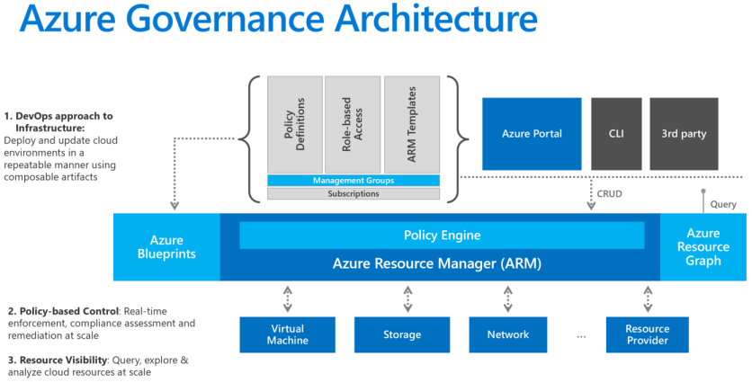

# Introduction

Azure Policy is used for centralized governance and deployment of resources in Azure and on-prem environments (via Azure Arc). View Microsoft's Documentation for full explanation on how policies are deployed, evaluated and mitigating non-compliant resources: https://docs.microsoft.com/en-us/azure/governance/policy/overview.

Azure Policies have the following main functions:
- Evaluate Azure resource properties and compare them to the policy definition
- Control what happens after Azure Resource Manager gets create or update requests via all supported tools like Azure Portal, Azure CLI +++
- Remediate non-compliant resources by changing properties or deploying additional resources to mitigate compliance issues



# Azure Policy Architecture
Azure policy has a set of important objects that make up the framework for evaluating resources and act upon them.

Resources are evaluated at specific times during the resource lifecycle:
- A resource is created or updated in a scope with a policy assignment
- A policy or initiative is newly assigned to a scope
- A policy or initiative already assigned to a scope is updated
- During the standard compliance evaluation cycle, which occurs once every 24 hours

## Policy Definitions
A policy definition describes the conditions that it operates under and what effects should be taken when the conditions are met. Conditions are used to filter on which resources policies should be evaluated for any given policy. Examples of effects in a policy are: append, audit, deny, deploy, auditIfNotExist, deployIfNotExists, modify

There are both built-in policy definitions and custom made definitions.

## Initiative (Policy Set)
An initiative is a collection of policies and is the recommended object to use in Assignments. Initiatives can contain contain a mix of custom and built-in policy definitions.

## Assignments
Assignments are initiatives or policy definitions that are assigned to a specific scope, from ManagementGroup to individual Resources. Assignments are inherited by all child resources. Initiatives and policy definitions can be assigned multiple times to different scopes. Assignments can exclude one or more resources in a subscope of the assignment scope.

## Remediation
Policy effects primarily affects resources when they are created or updated. After assignment of a policy there might be resources that are not compliant and these will not automatically be changed and put into compliance based on the effect of the definition. Remediation is a way of making these resources compliant after the fact.

# Project setup
YAML Pipelines are used for Initiative Deployment/Assignment and Role Assignments

## Identities, RBAC and permissions
Service connection used for pipeline deployment is linked to the service principal hc-devops-policy. This SP has the following RBAC permissions on the Management Groups: company-MG:
- Contributor
- User Access Administrator
- Resource Policy Contributor

These permissins are required both for policy deployment and for RBAC assignments for the User-Assigned Managed Identity id-azurepolicy. This UAMI is used for execution of all policy effects that require changes to be made to resources. This UAMI is given least-privileged RBAC permissions on resources and will have different RBAC permissions on multiple levels in the hierarchy.

## Catalog structure
```
|--Azure-Policy
|  |--AzureArc (All Initiatives have their own root folder)
|  |  |--Custom
|  |     `--*.json (Custom Policy Definitions within the Initiative)
|  |  |--*.yml (YAML-based Pipeline)
|  |  |--params-prod.json (Parameteres defined for and used in the Initiative Assignment)
|  |  |--r_*.bicep (Bicep-modules where targetscope is a Resource Group)
|  |  |--s_*.bicep (Bicep-modules where targetscope is a Subscription)
|     `--mg_*.bicep (Bicep-modules where targetscope is a Management Group)
|  |--Builtin_Policy_Ids
|     `--builtin.json (Key/Value pair of Built-In policies in Azure. Used for reference in Policy Initiatives)
|  |--Builtin_Role_Ids
|     `--builinroles.json (Key/Value pair of Built-In RBAC Roles in Azure. Used for reference in Role Assignments)
|  |--modules
|     `--*.bicep (Common bicep modules used across Azure Policy Initiatives)
`--README.md (This Markdown file)
```